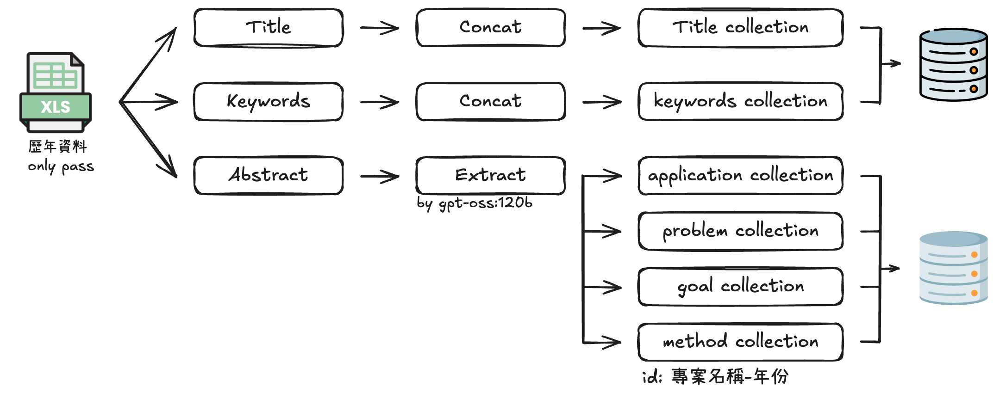
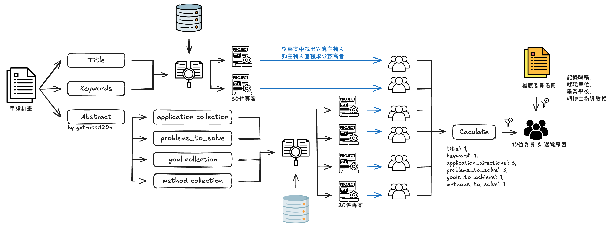

# 國科會（NSTC/MOST）審查委員推薦系統 — 系統規格書 (Specification)

> 版本：v1.0　｜　文件性質：系統規格 / 設計文件 (System Specification & Design)
> 對象：開發者、指導教授、後續維護者

---

## 1. 專案概述 (Overview)

本系統針對國科會研究計畫 / 產學合作計畫的**審查委員推薦**任務，依據「當次申請計畫」與「歷年通過計畫」之語意相似度，推薦最相關的潛在審查委員；並自動套用**利益迴避 (conflict-of-interest) 規則**過濾不適任者，最後輸出可供人工挑選的 Excel 名冊。

核心價值：
- **相似度推薦**：以向量檢索 (vector retrieval) 找出研究領域最相近的過往計畫主持人作為候選委員。
- **利益迴避自動化**：同校、畢業同校、指導教授 / 師生關係、本次申請人、黑名單 / 退休、職稱限制等規則自動過濾並標示原因。
- **可追溯**：每位推薦委員可回溯「依據哪一件過去計畫」被推薦，並保留過濾前 / 過濾後兩份名單。

---

## 2. 系統目標與範疇 (Goals & Scope)

| 項目 | 內容 |
|------|------|
| 主要目標 | 由申請計畫自動產生「推薦委員名冊」與「利益迴避後之乾淨名冊」 |
| 支援計畫類型 | 研究計畫 (research)、產學合作 (industry) |
| 不在範疇 | 最終委員的人工決定、送審流程、通知作業 |

---

## 3. 名詞定義 (Glossary)

| 名詞 | 說明 |
|------|------|
| 申請計畫 (apply project) | 本次要審查、需推薦委員的計畫 |
| 候選委員 / 推薦委員 | 由相似度檢索得到的歷年計畫主持人 |
| 候選池 (candidate pool) | 每案取相似度前 `POOL_SIZE` 名，供過濾後遞補使用 |
| 利益迴避 (COI) | 委員與申請人存在特定關係時應迴避審查 |
| 遞補 (backfill) | 被過濾掉的委員由候選池中依分數往下補足 |

---

## 4. 系統架構 (Architecture)

### 4.1 技術堆疊 (Tech Stack)
- **語言 / 執行**：Python 3.10；`main.py`（CLI）或 `mainGUI.py`（GUI）；設定用 `settingGUI.py`
- **向量資料庫**：ChromaDB（persistent）
- **Embedding 模型**：`BAAI/bge-large-zh-v1.5`（中文語意向量）
- **LLM**：`gpt-oss:120b`（透過遠端 Ollama，做中文摘要拆解）
- **資料處理 / 輸出**：pandas、openpyxl（Excel 讀寫、上色、註解）

### 4.2 主要模組
| 模組 | 職責 |
|------|------|
| `utils/script.py` | 核心管線：建庫、相似度比對、過濾、Excel 產出 |
| `utils/filter_method.py` | 利益迴避判定（同校、師生、機構正規化） |
| `settingGUI.py` | **設定介面**：選檔案 / 工作表 / 欄位對應，寫回 `setting.yaml` |
| `utils/get_setting.py` | 讀取 `setting.yaml`、解析路徑與欄位對應 |
| `utils/generate_abstract.py` | 呼叫 LLM 拆解中文摘要 |
| `utils/store_vectordb.py`、`cal_embedding_bge_zh.py` | 向量寫入與 embedding |

---

## 5. 資料流程 / Pipeline

系統分兩種執行模式（見 `main.py --choose_mode`）：

### 模式 A：`存入資料庫`（建立向量庫，資料變動時才需重跑）
```
load_into_chroma_bge_manager()
  └─ 讀「歷年通過計畫」→（LLM 拆解摘要）→ 寫入 ChromaDB
```



> 圖：歷年通過計畫（only pass）→ **Title / Keywords** 直接存入 basic DB（Title collection、keywords collection）；**Abstract** 由 `gpt-oss:120b` 拆成 application / problem / goal / method 四個 collection，存入 abstract DB。每筆文件 id = `專案名稱-年份`。

### 模式 B：`輸出推薦委員`（實際產生推薦名冊）
```
update_peronsal_info_database()   # 更新暫存人才資料庫（併入本次申請人）
        ↓
statistic_committee()             # 產出人才資料 統計清單_RDF / _RDF_UNI（含學校、職稱）
        ↓
search_v3()                       # ① LLM 拆解「申請案」摘要為四欄位 ② 各欄位向量相似度比對 → Top-10 + 候選池 Top-30
        ↓
filter_committee()                # 利益迴避過濾 → 篩掉人員 / 篩選原因 + 遞補名單
        ↓
excel_process_VBA()               # 上色、加註解、產生「原始 / _過濾後」分頁
```



> 圖：**申請計畫**的 Title / Keywords 直接比對；**Abstract 同樣由 `gpt-oss:120b` 拆成四欄位再比對**（推薦端也會過 LLM）。每個欄位於向量庫取相似度最高的 30 件專案 → 由專案對應到主持人（同一主持人重複出現取**較高分**）→ 依權重 **Calculate** → 取前 **10 位委員 + 過濾原因**；再對照「推薦委員名冊」（職稱、就職單位、畢業學校、碩博士指導教授）做利益迴避過濾。

### 各階段輸入 / 輸出對照
| 階段 | 讀取 | 產出 |
|------|------|------|
| `search_v3` | 申請名冊、ChromaDB | `推薦表統合與分析.xlsx`、`temp/推薦候選池.json`、`temp/推薦依據計畫對應.json`、`similarity_record_*.xlsx` |
| `filter_committee` | 上述統計表、候選池、人才資料、指導教授資料、黑名單 | `過濾相近後統計表.xlsx`、`temp/過濾後合格委員.json` |
| `excel_process_VBA` | 過濾相近後統計表、候選池、對應表 | **最終輸出** `*_推薦表統合_VBA.xlsx` |

---

## 6. 輸入規格 (Input Specification)

輸入 Excel 的**欄位名稱**由 `setting.yaml` 的 `SOURCE.field` 對應，**不是寫死**。

> 🔧 **換檔案 / 改欄位對應請執行 `settingGUI.py`（設定介面），不要手動改 `setting.yaml`。**
> 流程：選計畫類型 → 選輸入 Excel → 選工作表(sheet) → 從表頭下拉逐一對應各欄位 → 自動寫回 `setting.yaml`（同時更新 `FINAL_COMMITTEE` 輸出檔名）。

核心欄位：

| setting.yaml 鍵 | 意義 | 範例欄名 |
|------|------|------|
| `計畫SHEET` | 要處理的工作表名稱 | `智慧計算` |
| `計畫名稱` | 申請計畫名稱欄 | `計畫名稱` / `計畫中文名稱` |
| `申請主持人欄位名稱` | 主持人姓名欄 | `主持人` / `計畫主持人姓名` |
| `申請機構欄位名稱` | 申請機構（含系所）欄 | `申請機構` / `單位名稱` |
| `申請共同主持人` | 共同主持人欄（可多欄） | `共同主持人` |
| `中文關鍵字` / `計劃摘要` / `職稱` | 關鍵字 / 摘要 / 職稱欄 | `中文關鍵字` / `中文摘要` / `現職` |

> ⚠️ **一致性要求**：`setting.yaml` 的欄名必須與輸入 Excel 完全相符（透過 `settingGUI.py` 對應可避免不一致），否則讀檔時會 `KeyError`。

其他輸入資料檔（`SOURCE.data`）：歷年通過 / 申請名冊、碩博士論文爬蟲結果 `NST_crawler_RDF.xlsx`（就職 / 畢業學校）、`committee_all_education_with_advisor.xlsx`（指導教授）、`retiree_blacklist.csv`（退休 / 黑名單）。

### 6.1 建庫（存入資料庫）輸入 — 需手動編輯 `setting.yaml`

「存入資料庫」讀取的是**歷年計畫**，換資料時須手動修改下列鍵，且**工作表(sheet)名稱有固定規則**（程式依規則讀取，非自由命名）：

**研究計畫**（`get_project_df`）
| setting.yaml 鍵 | 意義 | 工作表 / 欄位規則 |
|------|------|------|
| `計畫過去申請案件` | 歷年申請案件 Excel | 每個**年度各一分頁**，分頁名 = 年度（`108`、`109`…） |
| `計畫過去申請案件年分範圍` | 要讀取的年度清單 | 例：`["108","109","110","111","112","113","114"]` |
| `統計清單` | 判斷是否「通過」的比較清單（選用） | 每年度分頁名須為 **`{年度}總計畫清單`**（如 `108總計畫清單`）；以 `計畫中文名稱` 比對；找不到該分頁則該年度全視為通過 |
| `曾任委員` | 前任委員名單（txt） | 用於標記前任委員占比 |

**產學合作**（`get_industry_coop_proj`）
| setting.yaml 鍵 | 意義 | 工作表規則 |
|------|------|------|
| `產學過去申請名冊` | 歷年產學核定計畫 Excel | 固定讀取分頁名 **`專題計畫綜合查詢`**（寫死於程式，檔案內須有此分頁） |

> ⚠️ 研究計畫的分頁必須以**年度**命名、統計清單分頁必須是 **`{年度}總計畫清單`**；產學名冊必須含 **`專題計畫綜合查詢`** 分頁，否則建庫會讀不到資料。

**欄位名稱固定（寫死，不經 `setting.yaml` 對應）**：建庫（`load_into_chroma_bge_manager`）直接讀下列欄名，歷年資料檔內必須有這些欄：

| 固定欄名 | 用途 |
|------|------|
| `計畫主持人` | 委員（歷年計畫主持人）姓名 |
| `計畫中文名稱` | 計畫名稱（亦為統計清單比對是否通過的鍵） |
| `中文摘要` | 送 LLM 拆解四欄位 |
| `中文關鍵字` | keywords 向量 |
| `通過` | 由 `統計清單` 比對自動加上；研究計畫僅存 `通過=true` 者，產學則全存 |

> 📌 對比：**模式 B（輸出推薦委員）的當次申請名冊欄位可由 `settingGUI.py` 自由對應；模式 A（存入資料庫）的歷年資料欄位則是固定寫死的**，換檔案時欄名需與上表一致。

---

## 7. 輸出規格 (Output Specification)

輸出集中於 `data/output/<執行檔名_時間戳>/`，中間檔置於其 `temp/` 子資料夾。

| 檔案 | 內容 |
|------|------|
| `*_推薦表統合_VBA.xlsx`（**最終產物**） | 每個計畫類型含「原始分頁」與「`_過濾後`分頁」 |
| `過濾相近後統計表.xlsx` | 含 `篩掉人員`、`篩選原因` 欄 |
| `推薦表統合與分析.xlsx` | 相似度比對結果（推薦委員 1..10、相關分數） |
| `申請計畫拆解結果.xlsx` | LLM 拆解出的四欄位摘要 |
| `similarity_record_*.xlsx` | **每個類別（欄位）逐筆相似度分數**，供分析哪類別表現好 / 差 |
| `temp/*.json` | 候選池、推薦依據對應、過濾後合格委員（供跨階段傳遞） |

### 呈現規則
- **原始分頁**：被過濾委員的儲存格標**粉紅色**；儲存格**註解**第一行寫「過濾原因」（若有），其後為委員名稱 / 年份 / 機關 / 職稱 / 推薦依據計畫。
- **`_過濾後`分頁**：移除被過濾委員，並由候選池依分數**遞補至 10 位**；若該案無任何需過濾者，則保留原始名單（不清空）。
- `篩掉人員` / `篩選原因` **僅列出有推薦到（顯示於前 10 名）的委員**，候選池中未顯示者不列出。

---

## 8. 設定檔 `setting.yaml`

`setting.yaml` 分為 `SOURCE`（輸入欄位與資料檔）、`OUTPUT`（輸出檔名）、`DATABASE`（ChromaDB 路徑）、`MODEL`（Ollama host、LLM 與 embedding 模型）。

**兩種設定來源，請分清楚：**
| 設定內容 | 維護方式 |
|------|------|
| 「輸出推薦委員」用的**當次申請名冊 / 工作表 / 欄位對應** | 由 `settingGUI.py` 產生（以 ruamel.yaml 寫回） |
| 「存入資料庫」用的**歷年資料檔**（`計畫過去申請案件`、`計畫過去申請案件年分範圍`、`統計清單`、`曾任委員`、`產學過去申請名冊`） | **需自行手動編輯 `setting.yaml`**（settingGUI 不涵蓋）；**工作表命名規則見 §6.1** |

關鍵：
- `目前執行計畫`：`產學合作` | `研究計畫`（決定 `is_industry`）。
- `MODEL.OLLAMA_HOST` / `LLM_MODEL_NAME` / `EMBEDDING_MODEL_NAME`。

---

## 9. 相似度計算與權重 (Scoring)

1. **摘要拆解**：LLM（`gpt-oss:120b`）將**當次申請案**的中文摘要拆為四欄位
   （歷年通過計畫已於建庫時拆解）—
   `application_directions`（應用方向）、`problems_to_solve`（解決問題）、`goals_to_achieve`（目標）、`methods_to_solve`（解決方法）。
2. **分欄位檢索**：對六個欄位各自做向量相似度檢索
   （`title`、`keywords` 走 basic DB；四個摘要欄位走 abstract DB）。
3. **加權合計**（每位候選委員取其在各欄位的最佳分數後加權平均）：

   | 欄位 | 中文 | 權重 |
   |------|------|------|
   | `title` | 專案名稱 | 1 |
   | `keywords` | 關鍵字 | 1 |
   | `application_directions` | 應用方向 | 3 |
   | `problems_to_solve` | 解決問題 | 3 |
   | `goals_to_achieve` | 目標 | 1 |
   | `methods_to_solve` | 解決方法 | 1 |

   `最終分數 = Σ(欄位最佳分數 × 權重) / Σ權重`
4. **排序取名**：每案取 Top-10 顯示、Top-30 作候選池。

參數（`search_v3`）：`RECOMMAND_AMOUNT=10`、`POOL_SIZE=30`、`SELECT_AMOUNT=3`。

---

## 10. 利益迴避規則 (Conflict-of-Interest Rules)

於 `filter_committee` / `filter_method.py` 判定，命中即列入 `篩掉人員` 並記錄原因：

| 規則 | 判定 | 備註 |
|------|------|------|
| **黑名單 / 退休** | 委員在 `retiree_blacklist.csv` | 照樣推薦→標色→過濾後移除 |
| **本人 / 本次申請人** | 委員名 = 申請人 或在本次全體申請人中 | 產學模式才過濾全體申請人 |
| **就職同校** | 委員曾就職學校 ∩ 申請 / 共同主持機構 | 學校名以 `split_institution` 正規化至「校級」 |
| **畢業同校（校友）** | 委員畢業學校 ∩ 申請 / 共同主持機構 | 同上，**同校不同系亦過濾** |
| **師生關係** | 委員為申請人指導教授，或曾受申請人指導 | 依 `committee_all_education_with_advisor.xlsx` |
| **職稱限制** | 助理教授 / 助研究員 不得審查 教授 / 研究員 | `TITLE_RESTRICTIONS` |

> **機構正規化**：`split_institution()` 以「大學 / 院 / 學校 / 法人…」為界，將「學校＋系所」切分為校級名稱，確保**同校不同系**也能比中。

---

## 11. 執行方式 (How to Run)

兩種模式的**前置設定與步驟不同**，請分開執行。日常操作**建議用 `mainGUI.py`**，在介面中選擇要執行的模式即可（CLI `main.py` 為替代方案）。共同前提：`setting.yaml` 的 `目前執行計畫`（`產學合作` / `研究計畫`）決定 `is_industry`。

### 11.0 前置：取得資料與設定檔（放置位置）
執行前需先備妥資料夾與設定檔（皆存放於 **NAS 的 `most_commitee` 資料夾**）：

| 項目 | 放置位置 / 取得方式 |
|------|------|
| `data/`（輸入資料與 `output/`） | 由 **NAS `most_commitee`** 下載，置於專案根目錄 |
| `database/`（ChromaDB 向量庫） | 由 **NAS `most_commitee`** 下載，置於專案根目錄 |
| `setting.yaml`（設定檔） | 由 **NAS `most_commitee`** 直接下載；**或**複製專案內 `setting_example.yaml` 修改內容後另存為 `setting.yaml` |

> 放置後專案根目錄應有 `data/`、`database/`、`setting.yaml`，才能正常執行下列模式。

### 11.1 模式 A：`存入資料庫`（建立 / 重建向量庫）
**何時執行**：歷年計畫資料變動時（不常，且較耗時，需 LLM）。

1. **手動編輯 `setting.yaml`** 的建庫歷年資料（`settingGUI.py` 不涵蓋，詳見 §6.1）：
   - 研究計畫：`計畫過去申請案件`、`計畫過去申請案件年分範圍`、`統計清單`、`曾任委員`
   - 產學合作：`產學過去申請名冊`（需含 `專題計畫綜合查詢` 分頁）
2. 執行建庫：**開啟 `mainGUI.py` → 選擇「存入資料庫」**
   （或 CLI：`python main.py --choose_mode 存入資料庫`）
   → 讀歷年計畫 →（LLM 拆解摘要）→ 寫入 ChromaDB。

### 11.2 模式 B：`輸出推薦委員`（產生推薦名冊）
**何時執行**：每次要對「當次申請名冊」產生推薦時（日常操作）。

1. **執行 `settingGUI.py`** 設定當次申請名冊 / 工作表 / 欄位對應：
   ```bash
   python settingGUI.py .        # Windows 可用 windows_setting.bat
   ```
2. 產生名冊：**開啟 `mainGUI.py` → 選擇「輸出推薦委員」**
   （或 CLI：`python main.py --choose_mode 輸出推薦委員`）
   → `update_peronsal_info_database` → `statistic_committee` → `search_v3` → `filter_committee` → `excel_process_VBA`。

> **注意**：模式 B 依賴模式 A 已建好的向量庫；若歷年資料已更新，需先跑模式 A 再跑模式 B。

---

## 12. 假設與限制 (Assumptions & Limitations)

- **姓名一致性**：委員 / 主持人姓名需在各資料檔一致；不一致會導致學校 / 師生查不到而漏過濾。
- **欄位對應**：模式 B 當次申請名冊欄名須與 `setting.yaml`（由 `settingGUI.py` 設定）相符；模式 A 建庫歷年資料則須符合**固定欄名**（見 §6.1）。
- **外部相依**：LLM 摘要拆解需可連線至 Ollama host；離線則四欄位為空、僅以 title/keywords 比對。
- **資料涵蓋**：利益迴避正確性取決於爬蟲 / 人才資料的完整度（就職、畢業、指導教授）。
- **相似度非因果**：分數僅代表語意相近，最終仍需人工判斷。

---

## 13. `optimize/` — 優化歷程與實驗程式碼

`optimize/` 是**先前的優化實驗版本**，也是目前正式管線（`utils/script.py`）比對方法的由來。

### 核心優化
- **比對方式**：由「將**計畫名稱 + 關鍵字 + 摘要**合併成一段文字後整體比對相似度」→ 改為「**各範疇（欄位）分別比對相似度、再加權加總**」。
- **摘要拆解**：摘要先用 local LLM（`gpt-oss:120b`）**拆成四個欄位**（應用方向 `application_directions`、欲解決問題 `problems_to_solve`、達成目標 `goals_to_achieve`、解決方法 `methods_to_solve`）再比對。
- 因此比對從「1 段合併文字」變為 **6 個欄位**（名稱、關鍵字 + 摘要四欄），與正式管線 §9 的權重設計一致。

### 與正式管線的關係
- `optimize/` 為**獨立 CLI 腳本**（`argparse`，各步驟路徑 / sheet / DB 路徑皆可用參數覆寫，`-h` 查說明），適合實驗與批次比較。
- 這些做法後來**整合進 `utils/script.py`** 的 `search_v3` / `filter_committee` 等，成為 GUI 驅動的正式流程。

### 主要檔案
| 檔案 | 說明 |
|------|------|
| `abstract.py` | 摘要拆解成四欄位（過往通過案件與當次申請案件皆適用） |
| `store_vectordb.py` / `store_vectordb_by_project.py` | 過往通過案件存入向量庫；分別以「**教授**」/「**專案**」為單位（2 個 vectordb、7 個 collection） |
| `apply_result.py` / `apply_result_by_project.py` | 計算申請案件與通過案件的相似度分數（教授 / 專案為單位） |
| `recommand.py` / `recommand_by_project.py` | 依分數輸出推薦委員並做利益迴避過濾（教授 / 專案為單位） |
| `save_commitee_data.py` | 蒐集過往通過與當次申請案件的教授名稱，供爬蟲使用 |
| `crawler_advisor.py` | 於 NDLTD（碩博士論文加值網）爬取教授的指導教授 |
| `crawler_degree.py` | 於 NSTC 研究人才查詢，以「姓名＋任職單位」取得畢業院校 |

> 詳細 CLI 參數與執行順序見 `optimize/README.md`。此資料夾定位為**研發 / 實驗參考**，正式產出請走 §11 的 `mainGUI.py` 流程。

---

## 附錄：目錄結構（重點）
```
MOST_committee/
├─ main.py / mainGUI.py        # 進入點（產生推薦名冊）
├─ settingGUI.py               # 設定介面（選檔 / 工作表 / 欄位對應）
├─ setting.yaml                # 設定（NAS 下載 或 由 settingGUI.py / setting_example.yaml 產生）
├─ setting_example.yaml        # 設定範本（可複製修改成 setting.yaml）
├─ utils/
│  ├─ script.py                # 核心管線
│  ├─ filter_method.py         # 利益迴避判定
│  ├─ get_setting.py           # 設定與路徑解析
│  └─ generate_abstract.py     # LLM 摘要拆解
├─ optimize/                   # 優化實驗版（CLI 腳本，正式管線之由來，見 §13）
├─ data/                       # 輸入資料與 output/（由 NAS most_commitee 下載）
└─ database/                   # ChromaDB（由 NAS most_commitee 下載）
```
